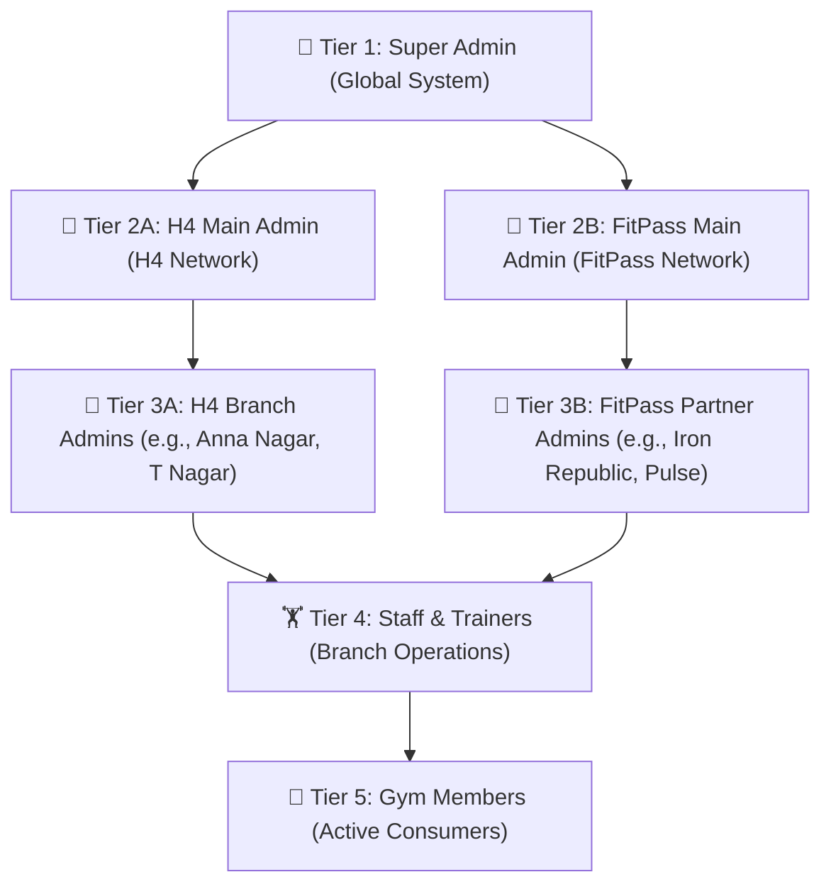
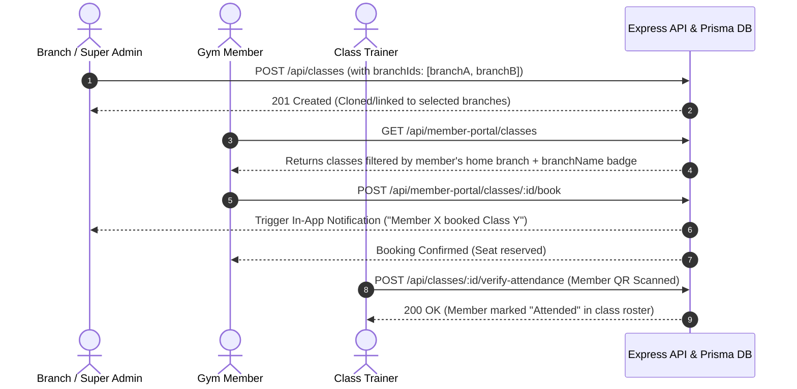
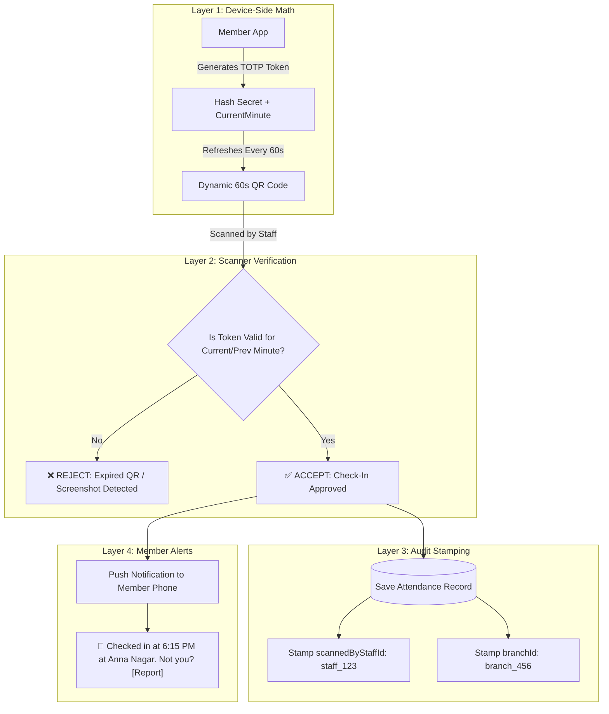

# Gym CRM & FitPass: Attendance & Classes System Revamp Specification

> **Document Version**: 1.0  
> **Status**: Approved Architecture & Specification  
> **Target Audience**: Stakeholders, Project Managers, Frontend & Backend Engineers  
> **Purpose**: This document provides a complete before-and-after breakdown of the Gym Management System's Classes, Attendance, Security Architecture, and Multi-Tier Hierarchy. It details existing gaps, real-world fraud cases, technical solutions, and the rationale behind each architectural decision.

---

## 1. Executive Summary & Vision

The goal of this revamp is to transform the existing Gym CRM and Mobile App from a generic, loosely decoupled prototype into an enterprise-grade, multi-tenant gym operations platform.

The system bridges two operational models:
1. **Traditional Gym Branches (e.g., H4 Fitness branches)**: Offering membership packages, personal training, studio workout schedules, and daily physical attendance.
2. **FitPass / FitPrime Network**: Offering multi-gym session-based access across independent partner fitness centers.

To ensure smooth operations, the platform requires:
* Strict **hierarchical access control** for class scheduling.
* **Branch-specific scoping** so members and trainers only see relevant workouts.
* A **unified 2-in-1 attendance system** serving both staff duty clock-ins and member reception check-ins.
* **Anti-fraud protection** preventing buddy punching, screenshot sharing, and staff misuse of member credits.

---

## 2. System Hierarchy & Administrative Governance

The platform operates on a strict 4-tier organizational hierarchy:



### Hierarchy Permissions Matrix

| Role | Class Creation Scope | Attendance View Scope | Staff Management Scope |
| :--- | :--- | :--- | :--- |
| **👑 Super Admin** | Can assign classes to **any combination of branches** across both H4 and FitPass via multi-select checkboxes. | Global attendance logs across all gyms and branches. | Full access to all staff, admins, and members. |
| **🏢 H4 Main Admin** | Can assign classes across **any or multiple H4 branches** simultaneously. | All H4 branch attendance records (staff & members). | Manages H4 branch managers, trainers, and members. |
| **🎫 FitPass Main Admin** | Can assign classes across **any or multiple FitPass partner gyms**. | Network-wide session check-in logs & audit trails. | Manages partner gym profiles and global plans. |
| **📍 Branch Admin** | Strictly confined to their **single assigned branch/gym**. | Staff duty attendance + Member check-ins for **their branch only**. | Manages branch trainers, receptionists, and local members. |
| **🏋️ Staff / Trainer** | Read-only access to classes assigned to their branch; scan access for class check-ins. | Can view today's member check-in log for their branch; clocks own duty attendance. | None. |
| **🏃 Member** | Can only browse and book classes available at their home/registered branch. | Views their **own personal attendance history only**. | None. |

---

## 3. Module 1: Classes & Studio Scheduling Revamp

### The Problem (What was implemented before)
1. **Zero Branch Association on Creation**: The admin creation form (`Classes.jsx`) did not have a branch selector field. Classes were saved without a specific `branchId`.
2. **Global Class Leakage**: The member API endpoint (`GET /api/member-portal/classes`) executed `GymClass.find({})` with no filters. Every member in every gym saw every class in the entire database.
3. **No Branch Identification on Cards**: Mobile class cards displayed Date, Time, Trainer, and Seats, but had zero mention of which branch or studio the class was taking place at.
4. **No Real-Time Booking Notifications**: When a member reserved a seat, no notification or event was dispatched to the branch admin.
5. **No Class-Specific Attendance Verification**: Admins could see who booked a seat, but trainers had no live camera tool to scan members into the actual workout session.

### The Real-World Use Case & Scenarios
* **Scenario A (Multi-Branch Studio Launch)**: Super Admin wants to schedule a celebrity "Master Zumba Class" across 3 specific branches (Anna Nagar, Velachery, and OMR). They need to select all 3 branches in one form without having to re-create the class 3 separate times.
* **Scenario B (Member Isolation)**: Member A (registered at Anna Nagar) opens their app. They should immediately see Anna Nagar studio classes, not classes happening 30 km away in OMR.
* **Scenario C (Trainer Class Verification)**: At 7:00 AM, Trainer Arjun starts "HIIT Studio". 12 members reserved seats. Arjun opens the class card on his phone, taps "Scan Attendees", and scans each member as they enter the studio room to mark them as `Attended`.

### The Solution & Architecture


1. **Multi-Branch Checkbox Picker in Admin CRM**:
   * When creating a class, a multi-select list of branches appears.
   * Checkboxes are grouped and tagged: `[H4]` and `[FitPass]`.
   * Admins only see checkboxes permitted by their hierarchical scope.
2. **Scoped Member Class Query**:
   * `getMemberClasses` extracts the member's `branchId` and `gymId` and returns classes explicitly assigned to their branch.
   * Each class payload attaches `branchName`, `branchAddress`, and `studioRoom`.
3. **Admin Real-Time Booking Alerts**:
   * Dispatches a record to the `Notification` table for the branch manager upon every booking.
4. **Trainer Class Scanner**:
   * In the Staff Mobile App, each class card contains a **"📱 Scan Attendees"** button.
   * Trainers scan the arriving member's QR code. The member's status in `gymClass.bookings` updates from `Reserved` to `Attended`.

---

## 4. Module 2: The Attendance System Revamp

### The Problem (What was implemented before)
1. **Disconnected Systems**: The platform had two separate, half-built attendance philosophies that did not communicate:
   * Web CRM had a scanner for staff to scan members.
   * Mobile App had a scanner for members to scan the gym desk.
2. **The "Missing QR" Dilemma**: Staff had a button to scan members' QR codes, but **the member mobile app never displayed a member QR code anywhere**. Staff had nothing to scan.
3. **The Critical Data Fetching Bug**: When a member checked in or staff marked them present, the record was saved in the `Attendance` table. However, the member's history endpoint (`GET /api/member-portal/attendance`) only queried `SessionCheckIn` and `FitPassAuditLog`. It **never queried `Attendance`**. As a result, members always saw `"No attendance records found yet"` even after checking in.
4. **Buried Staff Attendance**: The staff attendance interface on mobile was hidden 3 levels deep under `Operations Hub -> Operations & Finance -> Attendance`, making daily use impractical.

### The Real-World Use Case & Scenarios
* **Scenario A (Member Front Desk Check-in)**: Member walks into the gym, opens their app, and shows their personal pass. Receptionist scans it in under 2 seconds.
* **Scenario B (Member Self-Scan)**: Reception desk is busy. Member taps "Scan Gym QR", scans the acrylic standee at the gate, and walks in.
* **Scenario C (Staff Daily Presence)**: Trainer Rahul arrives for his shift at 6:00 AM. Before he can train clients or mark member attendance, he must scan the branch's daily duty QR code to clock in his own shift.

### The Solution & Architecture

#### A. Member Digital Pass (Dynamic Dual-ID)
* **Live Dynamic QR Code**: Rotates automatically (see Security Section below).
* **Backup 4-Digit PIN**: Displayed below the QR code for manual entry if the camera or screen is cracked.
* **Visit Streak & Frequency**:
  * **GitHub-Style Heatmap**: A visual contribution grid displaying workout streaks by week and month.
  * **Chronological History**: Clean feed showing date, time, branch name, and check-in method.

#### B. Staff 2-in-1 Attendance Hub
Located prominently on the Staff Dashboard:
* **Tab 1: "My Duty Clock-In"**: Staff scans the branch's daily duty QR code to start/end their shift.
* **Tab 2: "Member Reception Desk"**: Opens the live scanner and manual search dropdown to check in arriving members and view today's branch occupancy.

#### C. Database Query Unification
`getMyAttendance` is rewritten to execute a unified query merging:
1. Traditional desk check-ins (`Attendance` table).
2. Self-scan check-ins (`Attendance` table with `selfCheckIn: true`).
3. FitPass session check-ins (`SessionCheckIn` & `FitPassAuditLog` tables).

---

## 5. Module 3: Anti-Fraud & QR Security Architecture

### Real-World Threat Scenarios

#### Threat 1: "Buddy Punching" (Screenshot Sharing)
* **The Attack**: Member A stays in bed at home, takes a screenshot of their Member QR code, and sends it via WhatsApp to Member B or a friendly trainer at the gym to scan and fake their attendance or workout consistency.

#### Threat 2: Staff Credit Theft & False PT Commissions
* **The Attack**: A rogue trainer takes a photo of a member's QR code on their own personal phone. Over the next month, the trainer scans that photo daily:
  * For FitPass members: Burns their prepaid session credits without them knowing.
  * For traditional members: Fakes completed 1-on-1 Personal Training (PT) sessions to fraudulently claim PT commissions from the gym owner.

#### Threat 3: Staff Ghost Clock-In
* **The Attack**: A staff member prints the gym's check-in QR code, takes it home, and scans it from their bedroom every morning to claim full working hours.

---

### The 4-Layer Security Solution



### Technical Mechanics of the Defenses

#### 1. 60-Second Rotating TOTP (Time-based One-Time Password)
* The member's QR code is **not a static string**. It contains:
  ```json
  {
    "mid": "member_uuid",
    "ts": 1725539400,
    "token": "HMAC_SHA256(member_secret, timestamp_window)"
  }
  ```
* **How it stops Threat 1 & Threat 2**: If staff or a friend tries to scan a photo taken 5 minutes ago, the backend validator computes the hash for the current window and rejects the scan as `EXPIRED_QR_TOKEN`.
* **Zero Server Overhead**: The phone computes this hash **100% locally**. The phone makes **zero API requests** while displaying the QR code.

#### 2. Staff Audit Trail (`scannedByStaffId`)
* Every check-in database record permanently stamps:
  * `scannedByStaffId`: Exact user ID of the staff member who operated the scanner.
  * `scanMethod`: `QR_LIVE` or `MANUAL_PIN`.
* If a member disputes an unauthorized check-in, the Super Admin can instantly identify which staff member processed it.

#### 3. Instant Member Check-In Alerts
* The second an attendance scan succeeds, a push notification/in-app alert is dispatched to the member:
  > **"You checked in at H4 Anna Nagar at 06:15 PM. Not at the gym? [Report Fraud]"**
* Clicking "Report Fraud" immediately flags the attendance record in the Super Admin dashboard and blocks commission payout for that session.

#### 4. Daily Rotating Branch QR for Staff Duty
* The front desk duty QR code regenerates at midnight using a server-side branch salt.
* Staff cannot scan a saved photo from home because yesterday's QR code is invalid today.

---

## 6. Resource, Battery, and Infrastructure Impact

A common concern with dynamic security is server strain and phone battery drain. Here is the mathematical reality:

| Metric | Impact | Technical Reason |
| :--- | :--- | :--- |
| **Server Bandwidth** | **0% Increase** | The phone does **not** fetch new QR codes from the server. It calculates them offline locally. |
| **Backend Latency** | **< 2 milliseconds** | Verification is a single HMAC comparison in memory, avoiding heavy SQL queries. |
| **Phone Battery** | **< 0.01%** | The React Native SVG component re-renders once every 60 seconds on a lightweight interval. |
| **Hosting Compatibility** | **100% Compatible** | Runs effortlessly on low-tier or free hosting (Render, Vercel, Supabase, Neon). |

---

## 7. Revamp Implementation Checklist

```markdown
- [ ] 1. Backend: Update GymClass schema and controller to accept multi-branch assignment (`branchIds[]`).
- [ ] 2. Backend: Scope `getMemberClasses` to filter by member's branch and populate branch details.
- [ ] 3. Backend: Unify `getMyAttendance` to query `Attendance` table alongside session logs.
- [ ] 4. Backend: Implement TOTP token generation and validation helper (`totpHelper.js`).
- [ ] 5. Backend: Add `scannedByStaffId` and audit log dispatch on class and gym check-ins.
- [ ] 6. Frontend CRM: Add multi-select branch checkboxes in `Classes.jsx` based on admin role.
- [ ] 7. Frontend CRM: Add Class Attendance check-off sheet in class bookings modal.
- [ ] 8. Mobile App (Member): Build Dynamic Digital Pass screen with 60s rotating QR + 4-digit PIN.
- [ ] 9. Mobile App (Member): Integrate GitHub-style attendance heatmap in `H4Attendance.tsx`.
- [ ] 10. Mobile App (Staff): Build 2-in-1 Attendance Hub (Staff Duty Clock-In + Member Scanner).
- [ ] 11. Mobile App (Staff): Add "Scan Attendees" camera flow inside individual class cards.
```

---

*This document serves as the master blueprint for the implementation phase.*
